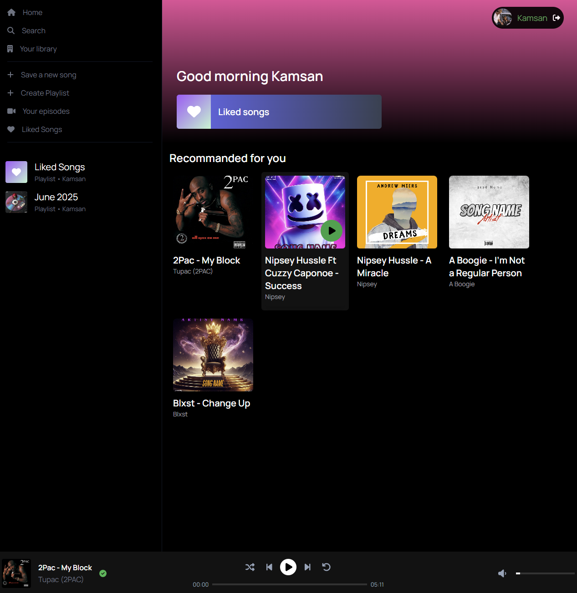
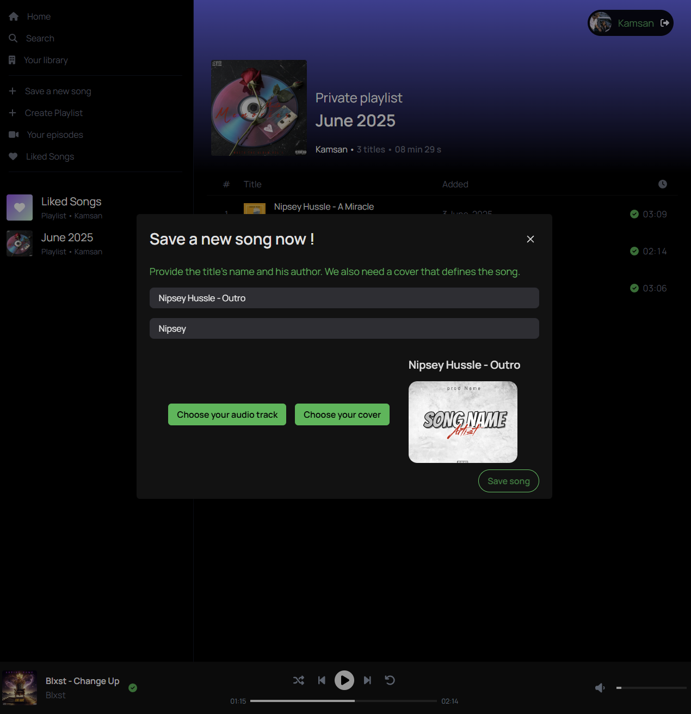
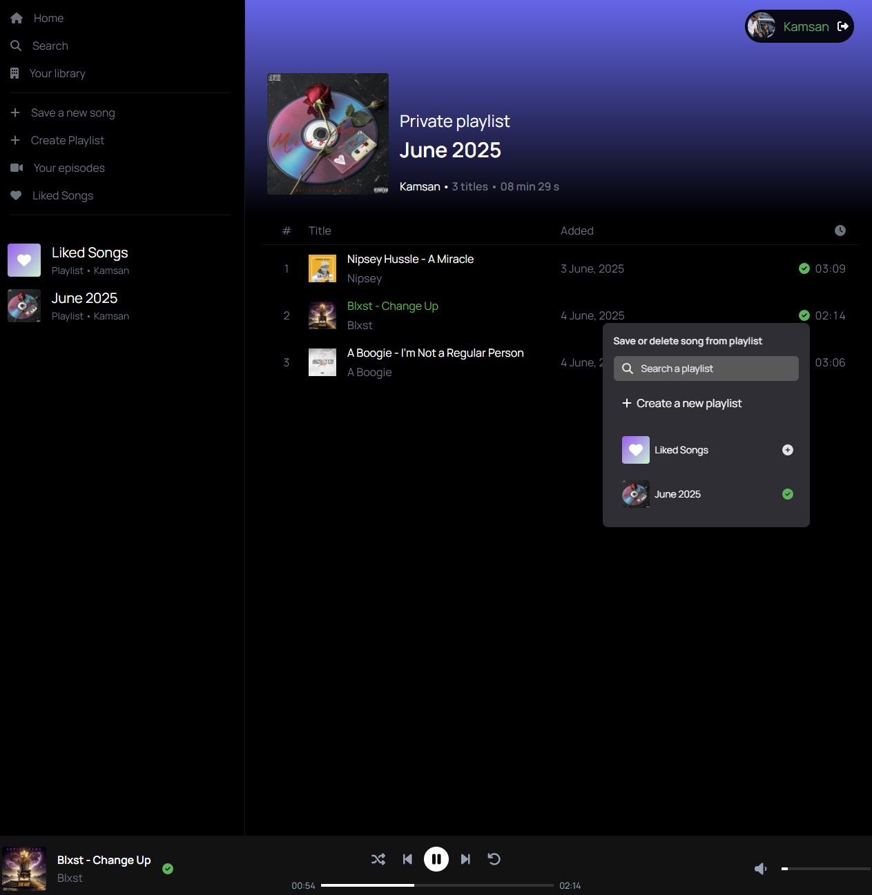

# Spotify clone application

### Key Features:

- 🔐 **Authentication**

  - Supports user authentication via Auth0, Okta, and Google.

- ➕ **Music Upload**

  - Users can upload their own music files to the platform.

- 🎶 **Browse All Songs**

  - Displays a complete list of all available tracks.

- ❤️ **Add favorites songs to Playlists**

  - Users can mark songs as favorites and add them to their playlists.

- 📂 **Playlists Management**

  - Create new playlists

  - Add songs to a playlist

  - Remove tracks from a playlist

  - View and manage existing playlists

- 🎧 **Music Streaming**
  - Stream and listen to music using Howler.js for seamless audio playback.

## 🛠️ Tech Stack

- Framework: Angular 17

- Server : Spring Boot 3.3

- UI Library: PrimeNG 17

- CSS Framework: Tailwind CSS

- Database : PostgresSQL

- API Communication: RESTful API integration

## 💻 UI Preview

#### Home

    

#### Save song

    

#### Manage playlist

    

